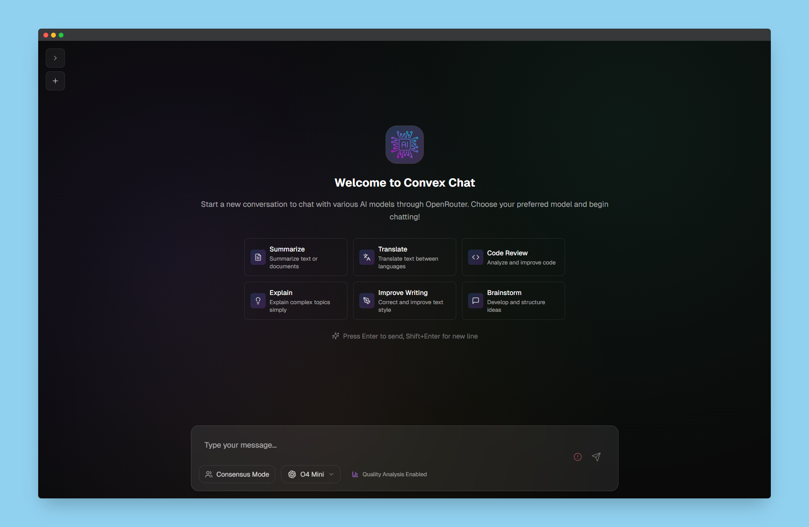
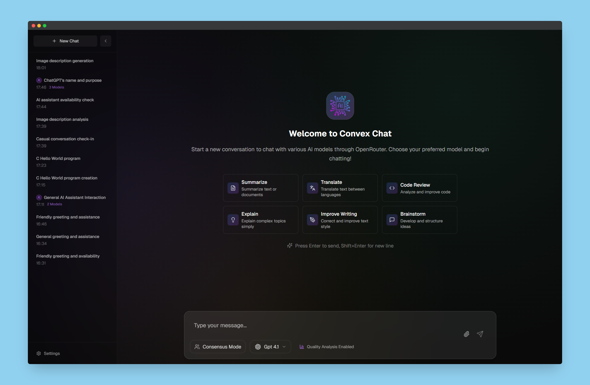

# T3 Chat Clone - Convex Chat - Cloneathon Submission

> **Live Demo:** [https://t3-clonathon.lukeschroeter.de/](https://t3-clonathon.lukeschroeter.de/)

A modern, feature-rich AI chat application built for the T3 Chat Cloneathon hosted by Theo Browne. This submission showcases advanced chat capabilities with multi-model consensus, file attachments, and a beautiful, responsive interface.

## 🏆 Competition Entry

This project is my submission for the **T3 Chat Cloneathon** - a competition to build the best T3 Chat clone within one week, competing for a **$10,000+ prize pool**.

**Competition Details:**
- **Deadline:** June 17, 2025 at 12:00 PM PDT
- **Prize Pool:** $10,000+ total
- **Requirements:** Open source AI chat app with multiple LLM support and authentication

## ✨ Features

### Core Requirements ✅

- **🤖 Multiple LLM Support** - Chat with 20+ AI models from leading providers
- **🔐 Authentication & Sync** - Secure user authentication with chat history synchronization
- **🌐 Browser Friendly** - Fully responsive web application
- **🚀 Easy to Try** - Live demo available with guest access

### Bonus Features ✅

- **📎 File Attachments** - Upload and analyze images and PDFs
- **🎯 Consensus Chat** - Get responses from multiple AI models simultaneously
- **🎨 Syntax Highlighting** - Beautiful code formatting with highlight.js
- **💾 Resumable Streams** - Continue conversations after page refresh
- **🔑 Bring Your Own Key** - Use your own OpenRouter API key
- **⚡ Real-time Streaming** - Live response streaming with typewriter effect

## 🛠️ Tech Stack

- **Framework:** Next.js 15 with App Router
- **Language:** TypeScript
- **Styling:** Tailwind CSS 4
- **Authentication:** Supabase Auth
- **Database:** Supabase (PostgreSQL)
- **AI Integration:** OpenRouter API
- **Animations:** Framer Motion
- **Icons:** Lucide React
- **Markdown:** React Markdown with syntax highlighting

## 🤖 Supported AI Models

The application supports **20+ cutting-edge AI models** from major providers:

### Google Models
- Gemini 2.0 Flash (001 & Lite)
- Gemini 2.5 Flash Preview
- Gemini 2.5 Pro Preview

### OpenAI Models
- GPT-4o Mini & GPT-4o (2024-11-20)
- GPT-4.1 (Full, Mini, Nano)
- o3-mini
- o4-mini

### Anthropic Models
- Claude Opus 4
- Claude Sonnet 4
- Claude 3.7 Sonnet
- Claude 3.5 Sonnet

### Meta Models
- Llama 3.3 70B Instruct
- Llama 4 Scout & Maverick

### Other Providers
- DeepSeek Chat V3 & R1 (Free)
- X.AI Grok 3 Beta & Mini

## 🧪 Testing Instructions

### Quick Start Testing

1. **Visit the Live Demo:** Navigate to [https://t3-clonathon.lukeschroeter.de/](https://t3-clonathon.lukeschroeter.de/)

2. **Create an Account:** Register with your email address, github or google profile through the secure Supabase authentication system

3. **Add Your API Key:** When prompted, enter your OpenRouter API key in the settings. This enables access to all 20+ AI models
   - Don't have an OpenRouter key? Get one free at [openrouter.ai](https://openrouter.ai)
   - Your key is encrypted and stored securely

4. **Start Chatting:** You're ready to explore all features immediately!

### Local Development Note

**⚠️ Local testing is currently not supported and not recommended.** The application relies on Supabase database functions with specialized configurations that are complex to replicate locally. The live demo provides the full, intended experience with all features working seamlessly.

For the best testing experience and to evaluate all competition features, please use the deployed version above.

## 📸 Screenshots

### Main Chat Interface

*Clean, modern chat interface with model selection and real-time streaming*

### Multi-Model Consensus Chat

*Compare responses from multiple AI models side-by-side*

### Model Selection

*Browse and select from 20+ AI models with provider logos and capabilities*

### File Attachments

*Upload and analyze images and PDFs with supported models*

### Settings & API Key Management

*Manage your OpenRouter API key and preferences*

### Chat History & Sidebar

*Organized chat history with conversation management*

### Authentication

*Secure authentication with Supabase*

## 🎯 Key Features Deep Dive

### Consensus Chat Mode
One of the standout features is the **Consensus Chat** mode, where you can:
- Select multiple AI models simultaneously
- Get responses from all selected models in parallel
- Compare different AI perspectives on the same question
- Perfect for complex problems requiring multiple viewpoints

### Intelligent File Processing
The application intelligently handles file uploads based on model capabilities:
- **Image Support:** JPEG, PNG, GIF, WebP (up to 32MB depending on model)
- **PDF Support:** Full document analysis for supported models
- **Smart Validation:** Only allows uploads for models that support the file type
- **Visual Indicators:** Clear capability icons showing what each model supports

### Advanced Chat Management
- **Auto-generated Titles:** Conversations get intelligent titles based on content
- **Persistent History:** All conversations saved and synced across devices
- **Resumable Streams:** Continue interrupted conversations seamlessly
- **Search & Organization:** Find past conversations quickly

### Performance & UX
- **Real-time Streaming:** See responses as they're generated
- **Optimistic Updates:** Instant UI feedback for better user experience
- **Keyboard Shortcuts:** Efficient navigation and interaction
- **Loading States:** Clear feedback during all operations

## 🔧 Architecture Highlights

### Frontend Architecture
- **Component-based Design:** Modular, reusable React components
- **Context API:** Centralized state management for chat functionality
- **Custom Hooks:** Reusable logic for common operations
- **TypeScript:** Full type safety throughout the application

### Backend Architecture
- **API Routes:** RESTful endpoints for all operations
- **Database Schema:** Optimized PostgreSQL schema for chat data
- **Authentication:** Secure JWT-based authentication with Supabase
- **File Storage:** Efficient file upload and storage system

### AI Integration
- **OpenRouter Integration:** Unified API for multiple AI providers
- **Streaming Support:** Real-time response streaming
- **Error Handling:** Robust error handling and fallbacks
- **Rate Limiting:** Built-in protection against API abuse

## 🚀 Performance Features

- **Lazy Loading:** Components loaded on demand
- **Image Optimization:** Next.js automatic image optimization
- **Caching:** Intelligent caching strategies for better performance
- **Bundle Optimization:** Minimal bundle size with tree shaking
- **Progressive Enhancement:** Works even with JavaScript disabled

## 🎨 Design Philosophy

The application follows modern design principles:
- **Glassmorphism:** Beautiful glass-like UI elements
- **Dark Theme:** Eye-friendly dark interface
- **Micro-interactions:** Subtle animations for better UX
- **Accessibility:** ARIA labels and keyboard navigation
- **Consistency:** Unified design language throughout

## 🔒 Security & Privacy

- **Secure Authentication:** Industry-standard authentication with Supabase
- **API Key Protection:** User API keys encrypted and stored securely
- **Data Privacy:** User conversations and data properly protected
- **HTTPS Only:** All communications encrypted in transit
- **Input Validation:** Comprehensive input sanitization

## 🌟 What Makes This Special

This T3 Chat clone goes beyond the basic requirements by offering:

1. **Unique Consensus Feature:** Compare multiple AI models simultaneously
2. **Advanced File Processing:** Intelligent file handling based on model capabilities
3. **Superior UX:** Polished interface with attention to detail
4. **Performance Optimized:** Fast, responsive, and efficient
5. **Extensible Architecture:** Built for future enhancements
6. **Production Ready:** Deployed and accessible with proper error handling

## 📝 License

This project is open source and available under the [MIT License](LICENSE).

## 🙏 Acknowledgments

- **Theo Browne** for organizing the T3 Chat Cloneathon
- **OpenRouter** for providing unified AI model access
- **Supabase** for authentication and database services
- **Vercel** for hosting and deployment platform

---

**Built with ❤️ for the T3 Chat Cloneathon**

> This project demonstrates modern web development practices, AI integration, and user experience design. It's not just a clone—it's an evolution of the chat interface with unique features and polished execution.
